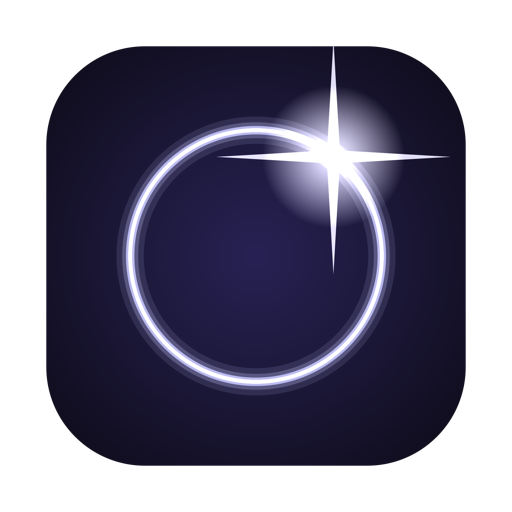

<p align="center">
  
</p>

<h1 align="center">Halo</h1>

<p align="center"><b>Everything at your cursor.</b></p>

A fast, glassy pie / radial menu and automation tool for macOS. Press **⌥Tab**
anywhere to summon a wheel and launch apps, run scripts, insert text, simulate
shortcuts, control media, browse clipboard history, and chain multi-step
workflows — without leaving what you're doing.

Native **Swift + SwiftUI**, built for **macOS 26 (Tahoe)** with real Liquid Glass
materials. No Xcode required to build — pure Swift Package Manager.

## Features

- **Radial launcher** — a ring of glass buttons; hover to highlight, release ⌥ or
  click to pick. Open at the cursor or screen center.
- **Actions** — launch apps, open URLs/files, keyboard shortcuts, AppleScript,
  shell commands, insert text.
- **Workflows** — chain actions into one item with a visual editor.
- **Clipboard history** — the last 10 copies (text, images, files) as an ordered
  side-list; pick one to make it current.
- **Media hub** — the center circle flips to now-playing (Spotify, Apple Music,
  and browser media) with album art + transport controls; swipe between sources.
- **Customizable** — click an empty slot to add an app, right-click to
  replace/remove; everything persists.
- **Configurable trigger** — hold-&-release or press-to-toggle, your choice.

## Install

Download the latest **`Halo.dmg`** from
[Releases](https://github.com/slashexx/halo/releases), open it, and drag **Halo**
to Applications.

> The current build is **not yet notarized**, so on first launch macOS Gatekeeper
> will warn. Right-click **Halo.app → Open → Open**, or run
> `xattr -dr com.apple.quarantine /Applications/Halo.app`. (Notarized builds are
> coming.)

Halo lives in the **menu bar** (no Dock icon). First launch shows a short welcome
that requests the permissions it needs.

## Build from source

```bash
./scripts/run.sh              # build + run with logs (Ctrl-C to quit)
./scripts/bundle.sh release   # just build Halo.app (optimized)
./scripts/make-icon.sh        # regenerate the app icon
./scripts/dmg.sh              # build a release DMG
```

Requires macOS 26+ and a Swift 6 toolchain (Xcode **or** Command Line Tools).

### Permissions

- **⌥Tab trigger** — none (Carbon hot key).
- **Accessibility** — for keyboard-shortcut / insert-text / media-key actions.
- **Automation** — asked per-app the first time Halo scripts Spotify, Music, or a
  browser.

## License

MIT — see [LICENSE](LICENSE).
